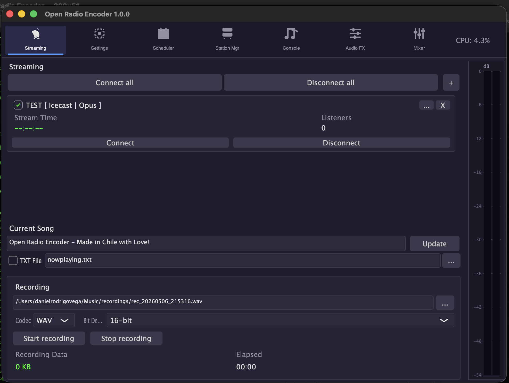

<p align="center">
  
</p>

<h1 align="center">Open Radio Encoder</h1>

<p align="center">
  <strong>Codificador de streaming de radio por internet multi-estación</strong><br/>
  Hecho en Chile con Amor!
</p>

<p align="center">
  
  
  
  
</p>

---

## Acerca de

**Open Radio Encoder** es un codificador profesional de streaming de radio por internet multi-estación. Captura audio desde cualquier dispositivo de entrada, procésalo a través de un ecualizador de 10 bandas, compresor y cadena de plugins VST3, luego codifícalo y transmítelo a múltiples servidores Icecast/Shoutcast simultáneamente — cada uno con configuraciones de códec independientes.

Nacido de una reescritura desde cero de **BUTT (Broadcast Using This Tool)** v1.46.0, Open Radio Encoder re-arquitectura el motor de streaming de un diseño de servidor único a un pipeline multi-hilo libre de bloqueos, capaz de manejar N transmisiones concurrentes.

---

## Características

- **Streaming multi-estación** — Transmite a N servidores Icecast/Shoutcast simultáneamente, cada uno con códec, bitrate y configuración de servidor independientes
- **6 códecs de audio** — MP3 (LAME), MP2 (TwoLAME), AAC/HE-AAC (FDK-AAC), Opus (libopus), Vorbis (libvorbis), FLAC (libflac)
- **EQ paramétrico de 10 bandas** + **Compresor dinámico** — Cadena DSP completa antes de la codificación
- **Host de plugins VST3** — Inserta cualquier plugin VST3 en la cadena de audio (procesamiento sin interfaz)
- **Medidores VU estéreo** — Medición en tiempo real de pico y RMS
- **Grabación** — Guarda localmente en WAV, FLAC, AIFF, MP3, MP2 u Opus
- **Auto-reconexión** — Backoff exponencial al perder conexión (máx. 10 reintentos)
- **Programador** — Automatización basada en tiempo para acciones de conectar/desconectar/grabar
- **Gestor de estaciones** — Editor CRUD completo para configuraciones de estaciones con persistencia JSON
- **Estado en tiempo real** — Estado de conexión por estación, tiempo de transmisión, conteo de oyentes, bytes enviados
- **Metadatos ICY** — Actualiza títulos de canciones dinámicamente en todas las estaciones conectadas
- **Monitor de carga CPU** — Visualización de uso de CPU con código de colores (verde <50%, amarillo <80%, rojo >80%)
- **Tema oscuro personalizado** — UI profesional construida con JUCE

---

## Capturas de Pantalla


---

## Instalación

### macOS

Descarga el último `OpenRadioEncoder-macOS.dmg` desde [Releases](https://github.com/danielrodrigohub/Open-Radio-Encoder/releases), ábrelo y arrastra la aplicación a tu carpeta de Aplicaciones.

### Windows

Descarga `OpenRadioEncoder-Windows.exe` desde [Releases](https://github.com/danielrodrigohub/Open-Radio-Encoder/releases) y ejecuta el instalador.

### Ubuntu / Debian Linux

Descarga `OpenRadioEncoder-ubuntu.AppImage` desde [Releases](https://github.com/danielrodrigohub/Open-Radio-Encoder/releases), hazlo ejecutable y corre:

```bash
chmod +x OpenRadioEncoder-ubuntu.AppImage
./OpenRadioEncoder-ubuntu.AppImage
```

### Compilar desde Código Fuente

**Requisitos:**
- CMake >= 3.22
- Compilador C++17 (GCC 9+, Clang 10+, MSVC 2019+)
- Framework JUCE (incluido como submódulo git)
- Dependencias: PortAudio, libmp3lame, twolame, libopus, libvorbis, libogg, libflac, fdk-aac, libshout, libsamplerate, OpenSSL

```bash
# Clonar con submódulos
git clone --recurse-submodules https://github.com/danielrodrigohub/Open-Radio-Encoder.git
cd Open-Radio-Encoder

# Instalar dependencias (Ubuntu/Debian)
sudo apt-get install -y cmake build-essential \
  libportaudio2 portaudio19-dev \
  libmp3lame-dev libtwolame-dev \
  libopus-dev libvorbis-dev libogg-dev \
  libflac-dev libfdk-aac-dev \
  libshout3-dev libsamplerate0-dev \
  libssl-dev \
  libfreetype-dev libfontconfig-dev \
  libcurl4-openssl-dev libasound2-dev \
  libx11-dev libxcomposite-dev libxext-dev libxrandr-dev \
  libglu1-mesa-dev

# Compilar
cmake -B build -DCMAKE_BUILD_TYPE=Release
cmake --build build --config Release -j$(nproc)
```

**macOS (Homebrew):**
```bash
brew install portaudio lame twolame libogg libvorbis opus flac libshout libsamplerate openssl fdk-aac
cmake -B build -DCMAKE_BUILD_TYPE=Release
cmake --build build --config Release -j$(sysctl -n hw.ncpu)
```

**Windows (vcpkg):**
```bash
vcpkg install portaudio lame twolame opus libvorbis libogg flac fdk-aac libshout libsamplerate openssl
cmake -B build -DCMAKE_BUILD_TYPE=Release -DCMAKE_TOOLCHAIN_FILE=<vcpkg-root>/scripts/buildsystems/vcpkg.cmake
cmake --build build --config Release
```

---

## Banderas CLI

| Bandera | Descripción |
|---------|-------------|
| `-h`, `--help` | Muestra el mensaje de ayuda y sale |
| `-v`, `--version` | Muestra la información de versión y sale |
| `-c`, `--config <ruta>` | Ruta al archivo de configuración `stations.json` (por defecto: `<user_app_data>/OpenRadioEncoder/stations.json`) |
| `--headless` | Ejecuta sin GUI (para uso en servidor/sin interfaz gráfica) |
| `--verbose` | Activa registro detallado (verbose logging) |

### Ejemplos

```bash
# Iniciar con configuración por defecto
OpenRadioEncoder

# Iniciar con archivo de configuración personalizado
OpenRadioEncoder --config /etc/radio/stations.json

# Iniciar con registro detallado
OpenRadioEncoder --verbose
```

---

## Arquitectura

```
PortAudio Callback (hilo RT)
    │
    ▼
Ring Buffer ──► Hilo Mixer
                   │
                   ├─ Ganancia Maestra
                   ├─ EQ 10 bandas + Compresor
                   ├─ Cadena de Plugins VST3
                   ├─ Clamp
                   ├─ Medidor VU
                   │
                   ├──► Ring Buffer Estación #1 ──► StationConnection #1
                   ├──► Ring Buffer Estación #2 ──► StationConnection #2
                   ├──► ...
                   └──► Ring Buffer Estación #N ──► StationConnection #N
                                                      │
                                                      ├─ Remuestreo (libsamplerate)
                                                      ├─ Codificar (LAME/TwoLAME/FDK-AAC/Opus/Vorbis/FLAC)
                                                      ├─ Enviar (libshout → Icecast/Shoutcast)
                                                      └─ Auto-reconexión (backoff exponencial)
```

---

## Protocolos de Streaming Soportados

| Protocolo | Librería | TLS |
|-----------|----------|-----|
| Icecast (HTTP PUT/SOURCE) | libshout | Sí (OpenSSL) |
| Shoutcast (ICY) | libshout | Sí (OpenSSL) |

---

## Códecs Soportados

| Códec | Librería | Modos | Contenedor |
|-------|----------|-------|------------|
| **MP3** | LAME | CBR, VBR, ABR | — |
| **MP2** | TwoLAME | CBR | — |
| **AAC / HE‑AAC** | FDK‑AAC | CBR, VBR | — |
| **Opus** | libopus | VBR | Ogg |
| **Vorbis** | libvorbis | VBR | Ogg |
| **FLAC** | libflac | Sin pérdida | Ogg |
| **WAV** | — | PCM (solo grabación) | — |

---

## Configuración

Las configuraciones de estaciones se guardan como JSON en:

- **macOS**: `~/Library/Application Support/OpenRadioEncoder/stations.json`
- **Windows**: `%APPDATA%/OpenRadioEncoder/stations.json`
- **Linux**: `~/.config/OpenRadioEncoder/stations.json`

Usa la bandera `--config` para sobrescribir la ruta.

---

## Licencia

GPLv3 — Ver [LICENSE](LICENSE) para detalles. Open Radio Encoder utiliza librerías bajo licencias compatibles con GPL (LAME, FDK-AAC, libshout).

---

## Agradecimientos

- **BUTT** (Broadcast Using This Tool) — La inspiración original, por Daniel Nöthen
- **JUCE** — Framework C++ multiplataforma por ROLI
- **libshout** — Librería de streaming Icecast/Shoutcast
- Todos los proyectos de códecs de audio open-source (LAME, TwoLAME, FDK-AAC, Opus, Vorbis, FLAC)

---

<p align="center">Hecho en Chile con Amor!</p>
